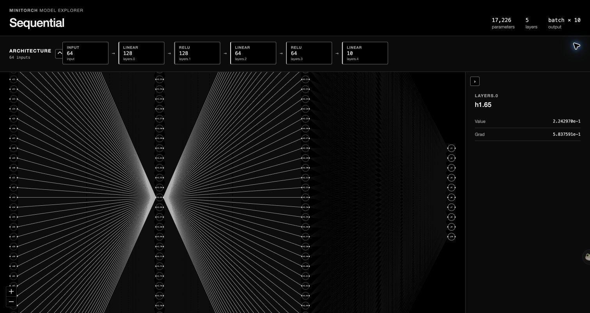

# MiniTorch

<p class="lead">
Fast NumPy autograd, compiled dense training, and inspectable neural networks.
</p>

MiniTorch is a compact scientific-computing framework for learning and
experimenting with reverse-mode automatic differentiation. Its Python surface
stays readable while first-order backpropagation uses raw NumPy gradient kernels
and static dense classifiers can move the complete training loop into compiled
C.

<div class="grid cards" markdown>

-   :material-lightning-bolt:{ .lg .middle } **Fast backpropagation**

    ---

    A linear-time reverse tape visits every graph node and edge once, without
    constructing a second graph during ordinary first-order training.

-   :material-language-c:{ .lg .middle } **Compiled training**

    ---

    Dense `Linear`/`ReLU` classifiers can run batching, forward, backward,
    softmax cross-entropy, and Adam in generated C while NumPy calls BLAS.

-   :material-graph-outline:{ .lg .middle } **Scientific model explorer**

    ---

    `visualize(model)` opens a self-contained full-neuron connection map.
    Selecting a neuron shows only its latest value and gradient.

</div>

[Get started](guide/getting-started.md){ .md-button .md-button--primary }
[Explore the model viewer](examples/visualization.md){ .md-button }

## Thirty-second example

```python
import numpy as np

from MiniTorch import Variable

x = Variable(np.array([[2.0]], dtype=np.float32), name="x")
w = Variable(np.array([[3.0]], dtype=np.float32), name="w")
b = Variable(np.array([[1.0]], dtype=np.float32), name="b")

loss = (x * w + b - 10.0) ** 2
loss.backward()

print(loss.data)    # [[9.]]
print(w.grad.data)  # [[-12.]]
```

## Choose a training path

=== "Eager autograd"

    Use eager execution for custom modules, dynamic Python control flow, new
    operations, or higher-order gradients.

    ```python
    logits = model(Variable(features))
    loss = softmax_cross_entropy(logits, Variable(labels))
    optimizer.zero_grad()
    loss.backward()
    optimizer.step()
    ```

=== "Compiled dense loop"

    Use the native loop for a static
    `Sequential(Linear, ReLU, ..., Linear)` classifier.

    ```python
    from MiniTorch.native import train

    history = train(
        model,
        x_train,
        y_train,
        epochs=15,
        batch_size=128,
        lr=1e-3,
    )
    ```

## Inspect the trained network

```python
from MiniTorch import visualize

visualize(model)
```


